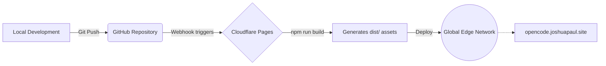

# Opencode Website

The official product and documentation website for the [Opencode](https://github.com/joshxdevs/opencode) CLI agent. 

**Live URL**: [https://opencode.joshuapaul.site/](https://opencode.joshuapaul.site/)

## Overview

This repository contains the source code for the Opencode landing page. The project is designed with a strict focus on minimalism, utilizing a vanilla technology stack to ensure maximum performance, zero external framework overhead, and precise control over styling and micro-animations.

### Technical Stack

- **Build Tool**: Vite
- **Structure**: Semantic HTML5
- **Styling**: Vanilla CSS (CSS Variables, Flexbox/Grid, native transitions)
- **Logic**: Vanilla JavaScript (IntersectionObserver API, DOM manipulation)

## Development

The project utilizes Vite as a development server and bundler.

### Prerequisites

- Node.js 18+
- npm (or bun)

### Setup

1. Clone the repository and install dependencies:
   ```bash
   git clone https://github.com/joshxdevs/opencode-website.git
   cd opencode-website
   npm install
   ```

2. Start the development server:
   ```bash
   npm run dev
   ```
   The site will be available at `http://localhost:5173`.

### Production Build

To generate static assets for production deployment:

```bash
npm run build
```
This command compiles the source files and outputs optimized static assets to the `dist/` directory.

## Deployment Architecture

The website is statically generated and deployed via Cloudflare Pages, ensuring global edge delivery and automated SSL management.



## Repository Structure

- `index.html`: The primary layout and document structure.
- `style.css`: All styling rules, design tokens, and animation definitions.
- `main.js`: Client-side logic for intersection observers, terminal typing effects, and clipboard interactions.
- `public/`: Static assets (e.g., favicon) served directly.

## License

MIT
